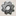
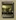
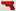
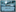
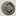

## Uwagi przed rozgrywką

Poniżej znajduje się zapis rozgrywki solo w grę 51 Stan Master Set. Podczas tej rozgrywki chciałem pokazać strategię, która pozwala spokojnie uzyskiwać 100+. Popełniłem jednak podczas tej rozgrywki kilka błędów, niektóre na moją krzyść inne na korzyść przeciwnika. Jednak absolutnie nie zmieniają one ogólnego przebiegu gry. Proszę zatem skupić się na ogólnej strategii niż na tych konkretnych błędach.

Popełnione błędy:
* w turze 4 podpisując umowę z [doki] powinienem był wziąć , ale omyłkowo wziąłem . Pozwoliło mi to jeszcze w tej samej turze zamienić 2 na 1. Zatem przez ten błąd wziąłem 1 więcej.
* w turze 6 turze niechcący przywłaszczyłem sobie kartę [ruiny biblioteki, magazyn 3///] (była to karta, którą wcześniej atakował przeciwnik i nie odłożyłem jej na stos kart odrzuconych). Ta karta nie dała mi żadnych korzyści (magazyn przydaje się na sam koniec). Jedynie dzięki niej zyskałem to, że w turze 8 po ataku przeciwnik odrzuciłem właśnie tę kartę, a gdyby nie ten błąd odrzuciłbym kartę [gladiator, produkcja 1].
* dopiero po tej grze, gdy doczytałem zasady gry solo, zorientowałem się, że po splądrowaniu mojej lokacji przez wirtualnego gracza nigdy nie pobierałem sobie zasobu z umowy lokacji

Można przyjąć, że gdyby nie popełnione błędy miałbym wynik o około 4-6 mniejszy.

W przebiegu są zapisy gdzie czasem wykonuję 2 razy te same akcje z kart. Nie jest to błąd gdyż miałem wybudowanych wiele takich samych lokacji.

Być może używając  lub  w zapisie widnieje to jako konkretny surowiec/żeton kontaktu. Po prostu odruchowo zapisywałem faktyczny koszt na karcie, niekoniecznie skupiając się na tym, że zamiast niego wydaję, któryś z jokerów.

## Strategia

Analiza całego przebiegu rozgrywki może być nużąca więc opisuję przyjętą przeze mnie strategię. Zacznę od kilka obserwacji:

* przeciwnik dostaje po 2 za wzięcie  i 
* przeciwnik dostaje 2 za udany atak na lokację gracza
* przeciwnik dostaje 1 jeśli gracz skorzysta z jego otwartej produkcji

Mogłoby się wydawać, że przeciwnik będzie zdobywać po około 4 na turę, a więc gra zamknie się w 5 turach. Jednak szybko można dojść do wniosku, że:
* nie musimy korzystać z otwartej produkcji przeciwnika
* biorąc zawsze jedną z / przeciwnik dostanie 2 zamiast 4
* przeciwnik nie będzie w stanie splądrować naszej lokacji dopóki... nie mamy żadnej wybudowanej

Biorąc pod uwagę, że mamy tylko 6 i 6 to jeśli przez 6 pierwszych tur zawsze będziemy podkradać jedną z nich oraz będziemy oddalać moment budowania lokacji to możemy dzięki temu rozegrać nawet 13 (sic!) tur:
* tury 1-6: bierzemy zawsze jedną z kart kontaktu, nie budujemy nic, podpisujemy same umowy, przeciwnik zdobywa w nich po 2
* tury 7-12: nie ma już kart kontaktu, zaczynamy budować lokacje, zakładając, że zawsze splądruje nam jedną z nich to dostanie po 2
* przed turą 13 przeciwnik ma 24, ta będzie ostatnią

Jednak przy tej strategii pojawia się problem braku kart (ja póki co gram bez żadnego dodatku, 88 kart podstawki). Prowadzi to do sytuacji, że nie ma żadnych kart odrzuconych, zatem nie można z nich utworzyć nowego stosu dobierania i... gracz wirtualny nie może atakować. A to oznacza, że jego postęp punktowy stoi w miejscu.

Dlatego ja w tej przykładowej rozgrywce zacząłem budować wcześniej, tak aby nie sprowokować takiej sytuacji.

Wracając jednak do strategii. Oto jej główne cele:
* początkowe kilka tur wykorzystać na umowy, nie budować nic
* jedynym wyjątkiem od powyższego są karty, która mają ikony występujące rzadko w talii - są to w szczególności karty knajpa i motel, które mają tylko ikonę karty występującą tylko na jeszcze jednej innej karcie w talii (łącznie 3). Dzięki temu jest mała szansa, że przeciwnik wylosuje ją podczas ataku, a my stracimy ją.
* następie skupiamy się na tym by mieć jak największą produkcję 
* mając dobrą produkcję  możemy przystąpić do budowy dużej ilości lokacji, korzystając z tych tokenów budujemy te najtańsze (najlepiej o dystansie 1) lokacje
* te drogie będziemy budować na koniec gry przez przebudowę za 1
* dlatego musimy mieć na koniec gry też dobrą produkcję 
* musimy podczas gry zdobyć kilka kart typu rafineria, fabryka, knajpa morderców. Każda z nich daje maks. 5 i mając tak dużo wybudowanych lokacji na pewno zgarniemy ich maksymalną ilość

Jak wygląda ostatnia tura?:
* mamy na ręce prawie same drogie lokacje (dystans 2 i 3)
* ponieważ mamy już wybudowanych sporo lokacji to każdą kartę jesteśmy w stanie przebudować za 1 (praktycznie nie ma możliwości żebyśmy nie mieli pasującej ikony)
* po każdym wybodwaniu/przebudowaniu lokacji, które mają akcję dającą  wykonujemy ją
* takie kombo może nam dać kilkadziesiąt punktów

## Skróty, oznaczenia

WG - wirtualny gracz

## Przygotowanie do gry

gram frakcją Sojusz Mutantów
* produkcja frakcji: 3, 1, 1, 1
* dostępne akcje
  * 2 -> 2
  * 1 -> 3
  * 1 -> 1

draft
* 6 kart: doki, dostawca cegieł, platforma wiertnicza, gladiator, ogromna maszyna, knajpa
* odrzucam: dostawca cegieł, gladiator
* wybieram: doki, platforma wiertnicza, ogromna maszyna, knajpa

## TURA 1

faza wypatrywania

* ja: sklep cassiego, złomowisko
* WG: radioaktywne paliwa, kryjówka, zbiornik paliwa

produkcja: 3, 1, 1, 1 [sharrash]

akcje

* 2 -> 1
* WG bierze  -> dostaje 2
* 1 -> 3
* WG atak #1 -> niepowodzenie
* 3 -> plądruję kartę produkcyjną WG - dostaję 2
* WG atak #2 -> niepowodzenie
*  -> 2
* WG atak #3 -> niepowodzenie
* 1 -> umowa z [sharrash, produkcja 1], dostaję 1
* WG pasuje
* 1 -> 1
* 2 -> umowa z [knajpa, produkcja 1], dostaję 1 [stare kino]
* 1 -> umowa z [sklep cassiego, produkcja 1], dostaję 1

punktacja: WG 2, ja 0

## TURA 2

faza wypatrywania
* ja: motel, ciężki sprzęt
* WG: broń biologiczna, handlarz bronią, spowiednik

produkcja: 1, 1, 1, 3, 1, 2 [montownia, kamieniołom]

akcje

* 2 -> 1
* WG bierze  -> dostaje 2
*  -> 3
* WG atak #1 -> niepowodzenie
* 1 -> plądruję kartę [stare kino], dostaję 1 i 1 [radioaktywne paliwa]
* WG atak #2 -> niepowodzenie
* 1 -> 3
* WG atak #3 -> niepowodzenie
* 1 -> umowa z [doki, produkcja 1], dostaję 1
* WG pasuje
* 2 -> umowa z [radioaktywne paliwa, produkcja 1], dostaję 1
* 1 i 1 -> na 2
* 2 -> buduję [motel, akcja 1 -> 1, maks. 2x]
* akcja karty [motel]: 1 -> 1 [twierdza nafciarzy]
* 1 -> 1
* 1 -> umowa z [złomowisko, produkcja 1], dostaję 1
* 1 -> umowa z [kamieniołom, produkcja 1], dostaję 1

punktacja: WG 4, ja 1

## TURA 3

faza wypatrywania
* ja: rafineria, sklep z bronią
* WG: koparka, kościół + jakaś 3 karta (nie zapisałem)

produkcja: 1, 1, 1, 3, 1, 1, 1, 2, 2 [ciężki sprzęt, wieżowiec]

akcje

* 2 -> 1
* WG bierze 1 -> dostaje 2
* akcja karty [motel]: 1 -> 1 [zniszczony czołg]
* WG atak #1 -> niepowodzenie
* 1 -> 2
* WG atak #2 -> niepowodzenie
* 1 -> 1
* WG atak #3 -> niepowodzenie
* 3 -> umowa z [wieżowiec, produkcja 1], dostaję 1
* WG pasuje
*  -> 3
* 2 -> plądruję kartę [zniszczony czołg], dostaję 2

punktacja: WG 6, ja 3

## TURA 4

faza wypatrywania
* ja: posterunek simona, doki
* WG: kościół, wieżowiec, gruzowisko

produkcja: 1, 1, 1, 3, 1, 2, 1, 2, 2 [fabryka, szkoła]

akcje

* 2 -> 1
* WG bierze 1 -> dostaje 2
* 1 -> 3
* WG atak #1 -> niepowodzenie
* 1 -> 2
* WG atak #2 -> niepowodzenie
* 1 -> umowa z [szkoła, produkcja 1], dostaję 1
* WG atak #3 -> niepowodzenie
* akcja karty [motel]: 1 -> 1 [podziemny magazyn]
* WG pasuje
* akcja karty [motel]: 1 -> 1 [montownia]
* 1 -> 1
* 1 -> umowa z [posterunek simona, produkcja 1], dostaję 1
* 1 -> umowa z [doki, produkcja 1], dostaję 1 (tutaj niestety popełniłem błąd i wziąłem 1)
* 2 -> 1 [kotłownia]
* 2 -> 2
* 2 -> buduję [kotłownia, produkcja 2 + bonus 1], dostaję 3
* 2 -> 1 [arena]

punktacja: WG 8, ja 3

## TURA 5

faza wypatrywania
* ja: schron, skład cegieł
* WG: handlarz gruzem, rusznikarz, zbiornik paliwa

produkcja: 1, 1, 1, 7, 1, 2, 1, 3, 2 [sklep z bronią, opustoszała osada]

akcje

* 2 -> 1
* WG bierze 1 -> dostaje 2
* akcja karty [motel]: 1 -> 1 [kamieniołom]
* WG atak #1 -> niepowodzenie
* akcja karty [motel]: 1 -> 1 [kult paliwa]
* WG atak #2 -> niepowodzenie
* 1 -> 1
* WG atak #3 -> niepowodzenie
* 1 -> 3
* 2 -> plądruję [kult paliwa], dostaję 1, 1, 1 [szkoła]
* 1 -> umowa z [kamieniołom, produkcja 1], dostaję 1
* 1 i 1 -> umowa z [opustoszała osada, produkcja 1], dostaję 1
* 2 -> 1 [parking]
* 1 -> buduję [szkoła, produkcja 1, bonus 1], dostaję 2
* 2 -> 1 [kryjówka]
* 2 -> 2
* 2 -> buduję [platforma wiertnicza, produkcja 1 za każdy niebieski symbol, max 3.], dostaję 1

punktacja: WG 10, ja 4

## TURA 6

faza wypatrywania
* ja: ogromna maszyna, kryjówka złodziei
* WG: muzeum, zniszczony czołg, dostawca cegieł

produkcja: 1, 1, 2, 8, 1, 3, 1, 3, 2 [rozjemca, rozjemca]

akcje
* 2 -> 1
* WG bierze 1 -> dostaje 2
* akcja karty [motel]: 1 -> 1 [wyrobisko gliny]
* WG atak #1 -> powodzenie, splądrowana karta [platforma wiertnicza], WG dostaje 2
* akcja karty [motel]: 1 -> 1 [twierdza nafciarzy]
* WG pasuje
* 2 -> 1 [broń biologiczna]
* 1 -> 1
* 1 i 1 -> umowa z [wyrobisko gliny, produkcja 1], dostaję 1
* 2 -> 2
* 1 -> buduję [ciężki sprzęt, produkcja 1 + bonus 1], dostaję 2
* 1 -> buduję [ciężki sprzęt, produkcja 1 + bonus 1], dostaję 2
* 1 -> buduję [ogromna maszyna, akcja 1 i 1 -> 3]
* 1 -> buduję [ogromna maszyna, akcja 1 i 1-> 3]
* akcja karty [ogromna maszyna]: 1 i 1 -> 3
* 2 -> buduję [parking, produkcja 1 za każdą ikonę żelaza, maks. 3], dostaję 3
* akcja karty [ogromna maszyna]: 1 i 1 -> 3
* 3 -> buduję [montownia, akcja 1 i 2-> 3]
* 2 -> buduję [kryjówka, akcja odrzuć 1 umowę -> 1, maks. 2x]
* 1 -> buduję [kryjówka złodziei, magazyn 2 /// i 2]
* 1 -> buduję [podziemny magazyn, magazyn 3 ///]

punktacja: WG 14, ja 4

## TURA 7

faza wypatrywania
* ja: sklep cassiego, arena
* WG: parking, handlarz paliwem, cień

produkcja: 3, 1, 2, 8, 1, 4, 1, 6, 2 [zniszczony czołg, szkoła]

akcje

* 1 -> 3
* WG atak #1 -> powodzenie, splądrowana karta [parking], WG dostaje 2
* 3 i 1 -> plądruję kartę WG [zniszczony czołg], dostaję 2
* WG pasuje
* akcja karty [motel]: 1 -> 1 [rozdroża]
* akcja karty [motel]: 1 -> 1 [gladiator] (to jest ostatnia karta z talii głównej, tutaj pierwszy raz tworzę nową talię tasując wcześniej użyte/odrzucone karty)
* 1 -> 1
* 1 -> umowa z [sklep cassiego, produkcja 1], dostaję 1
* 2 -> 2
* akcja karty [ogromna maszyna]: 1 i 1 -> 3
* 1 -> buduję [rozdroża, bonus za zbudowanie 2], dostaję 2 [platforma wiertnicza, platforma wiertnicza]
* 1 -> buduję [szkoła, produkcja 1, bonus 1], dostaję 2
* 1 -> buduję [gladiator, produkcja 1], dostaję 1
* akcja karty [ogromna maszyna]: 1 i 1 -> 3
* 3 -> buduję [montownia, akcja 1 i 2 -> 3]
* akcja karty [montownia]: 1 i 2 -> 3
* 2 -> 1 [obozowisko]
* 1 -> buduję [obozowisko, bonus 3 na kartę (magazyn)]
* 2 -> buduję [platforma wiertnicza, produkcja 1 za każdą ikonę paliwa, maks. 3], dostaję 3
* 2 -> buduję [platforma wiertnicza, produkcja 1 za każdą ikonę paliwa, maks. 3], dostaję 3
* akcja karty [montownia]: 1 i 2 -> 3

punktacja: WG 16, ja 12

## TURA 8

faza wypatrywania
* ja: wyrobisko gliny, parking
* WG: stacja z metalem, gladiator, handlarz złomem

produkcja: 3, 1, 3, 9, 1, 4, 1, 6, 2 [dostawca cegieł, wrak statku]

akcje

* akcja karty [motel]: 1 -> 1 [wrak statku]
* WG atak #1 -> niepowodzenie
* akcja karty [motel]: 1 -> 1 [kult paliwa]
* WG atak #2 -> powodzenie, plądruje kartę [ruiny biblioteki] (to drugi błąd w tej grze, patrz uwagi)
* 2 -> 1 [karawana złodziei]
* WG pasuje
* 2 -> buduję [wyrobisko gliny, akcja 1 i 1 -> 2]
* 1 -> 3
* 2 -> plądruję [kult paliwa], dostaję 1, 1 i 1 [melina gangsterów]
* 1 -> 1
* 2 i 1 -> umowa z [karawana złodziei, produkcja 1], dostaję 1
* 1 -> buduję [skład cegieł, bonus 3 na kartę (magazyn)]
* 1 -> buduję [ogromna maszyna, akcja 1 i 1 -> 3]
* 2 -> buduję [dostawca cegieł, produkcja 1 za każdą ikonę cegły, maks. 3], dostaję 2
* 1 -> buduję [ogromna maszyna, akcja 1 i 1 -> 3]
* 2 -> buduję [wrak statku, akcja 1 i 1-> 2]
* 2 -> buduję [parking, produkcja 1 za każdą ikonę żelaza, maks. 3], dostaję 3
* akcja karty [montownia]: 1 i 2 -> 3
* akcja karty [montownia]: 1 i 2 -> 3
* 2 -> 2
* 2 -> buduję [wrak statku, akcja 1 i 1 -> 2]

punktacja: WG 16, ja 19

## TURA 9

faza wypatrywania
* ja: knajpa morderców, zniszczony czołg
* WG: konwój, zbiornik paliwa, opuszczone przedmieścia

produkcja: 3, 1, 4, 9, 7, 7, 2, 6, 2 [ciężki sprzęt, archiwa]

akcje

* 1 -> 3
* WG atak #1 -> niepowodzenie
* 3 i 1 -> plądruję kartę WG [kościół], dostaję 2
* WG atak #2 -> powodzenie, splądrowana karta [motel]
* 1 -> buduję [ciężki sprzęt, produkcja 1, bonus 1], dostaję 2
* WG pasuje
* akcja karty [montownia]: 1 i 2 -> 3
* akcja karty [montownia]: 1 i 2 -> 3
* akcja karty [wrak statku]: 1 i 1 -> 2
* akcja karty [wrak statku]: 1 i 1 -> 2
* 1 -> buduję [archiwa, akcja 1 -> 1, maks. 2x]
* 2 -> buduję [rafineria, bonus 1 za każdą ikonę paliwa, maks. 5], dostaję 5
* akcja karty [kryjówka]: odrzucam umowę z [kanjpa] -> 1
* akcja karty [kryjówka]: odrzucam umowę z [sharrash] -> 1
* 1 -> przebudowa [ciężki sprzęt] w [schron], dostaję 1
* akcja karty [schron]: 2 -> 2
* akcja karty [schron]: 2 -> 2
* 1 -> przebudowa [schron] w [fabryka, bonus 1 za każdą ikonę żelaza, maks. 5], dostaję 6
* 1 -> przebudowa [szkoła] w [broń biologiczna, akcja 1 i 1 -> 2], dostaję 1
* 1 -> przebudowa [fabryka] w [sklep z bronią], dostaję 1
* 1 -> przebudowa [wrak statku] w [sklep z bronią], dostaję 1
* 1 -> przebudowa [szkoła] w [arena, produkcja 1 za każdą ikonę bronii, maks 3.], dostaję 1
* akcja karty [sklep z bronią]: 1 i 2 -> 3
* 1 -> przebudowa [arena] w [knajpa morderców, bonus 1 za każdą ikonę bronii, maks. 5], dostaję 6
* akcja karty [sklep z bronią]: 1 i 2 -> 3
* akcja karty [broń biologiczna]: 1 i 1 -> 2
* 1 -> przebudowa [broń biologiczna] w [twierdza nafciarzy], dostaję 1
* akcja karty [broń biologiczna]: 1 i 2 -> 3
* 1 -> przebudowa [twierdza nafciarzy] w [twierdza nafciarzy], dostaję 1
* akcja karty [broń biologiczna]: 1 i 2 -> 3
* 1 -> przebudowa [twierdza nafciarzy] w [melina gangsterów], dostaję 1
* akcja karty [melina gangsterów]: 2 -> 2
* 1 -> przebudowa [rafiniera] w [rozjemca], dostaję 1
* akcja karty [rozjemca]: 1 i odrzucam 1 umowę -> 2
* 1 -> przebudowa [rozjemca] w [rozjemca], dostaję 1
* akcja karty [rozjemca]: 1 i odrzucam 1 umowę -> 2
* akcja karty [wyrobisko gliny]: 1 i 1 -> 2
* 1 -> 2
* 2 -> plądruję kartę [zniszczony czołg], dostaję 2
* akcja karty [archiwum]: 1 -> 1
* akcja karty [archiwum]: 1 -> 1

punktacja: WG 18, ja 90

## podliczenie punktów

główna gra -> 90
wybudowane lokacje -> 26

razem: 116
